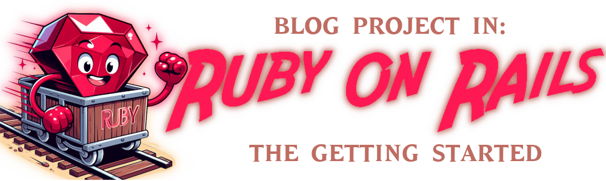
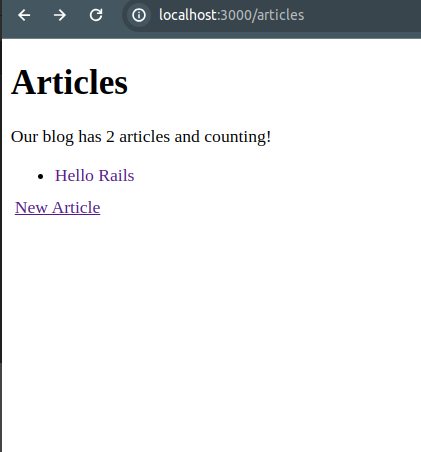
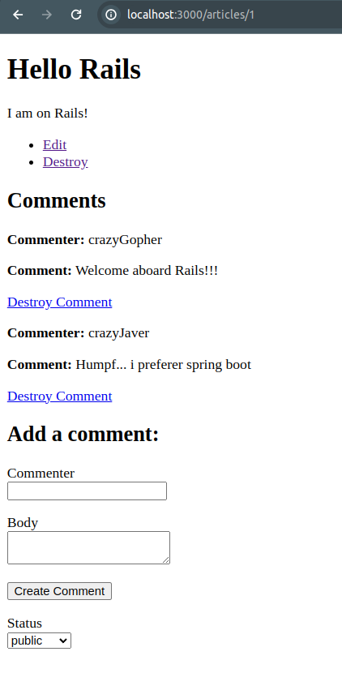
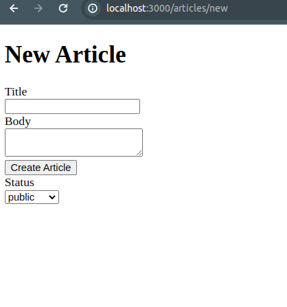

<a id="ruby-blog"></a>
# [ ](#ruby-blog) Ruby Blog

<!-- 
    Logo image generated by Bing IA: https://www.bing.com/images/create/
    Prompt: Image of a giant red ruby ​​symbol of the ruby ​​programming language, among a mine cart moving at good speed on a rail. flat colors, white background, cartoon style comic book
-->
[](#ruby-blog)

<!-- 
    icons by:
    https://devicon.dev/
    https://simpleicons.org/
-->
[](https://www.ruby-lang.org/en/) [](https://rubygems.org/) [](https://rubyonrails.org/) [](https://dev.w3.org/html5/spec-LC/) [](https://www.w3.org/Style/CSS/Overview.en.html) [](https://developer.mozilla.org/en-US/docs/Web/JavaScript)  [](https://www.sqlite.org/index.html) [](https://ubuntu.com/) [](https://code.visualstudio.com/) 

<!--
[](https://nodejs.org/en) [](https://webpack.js.org/)

[](https://cucumber.io/)

[](https://getbootstrap.com/)

[](https://www.jetbrains.com/ruby/download/#section=linux) [](https://www.docker.com/) [](https://docs.github.com/pt/actions)
-->

 <!---->

---

## 🕸️ Found me in Web:

[](https://www.linkedin.com/in/jos%C3%A9-r-99896a39/) [](https://dev.to/learningenuity) [](mailto:learningenuity@gmail.com) [](https://twitter.com/aromademirtilo) [](https://www.instagram.com/learningenuity) 

---

## 📁 The Project:

<a id="index"></a>
### ⤴️ index:

__[Ruby Blog](#ruby-blog)__:<br/>
  1. ⤴️ [Index](#index)
  2. 📗 [About](#about)
  3. 💻 [Run the Project](#run)
  4. 📊 [Diagrams](#diagrams)
  5. 🤖 [Use of AI](#ia)

<!--
  6. ✅ [Tests](#tests)
  7. 🪲 [Debug](#debug)
  8. 🕵️ [Observability](#observability) 
-->
 
<br/>

[⤴️ Back to Index](#index)

---

<a id="about"></a>
### 📗 About:

#### 📋 Ruby On Rails Blog

This project of a Blog is purely didactic and aims to follow the recommendations of [Getting Started with Rails](https://guides.rubyonrails.org/getting_started.html) so that I can familiarize myself with the 'Ruby Way'. Focused on enlightening me about this language and framework so that I can apply my development experience to yet another stack of technologies needed for my development.

I don't intend to delve too deeply into this repository beyond basic initial contact and some testing. In the near future I intend to create other repositories with studies based on documentation, courses, tutorials and more advanced books about the language and the framework.

#### 📷 Screenshots

 <br/>
 <br/>
 <br/>
 <br/>

#### 📚 Another References

I also used the following videos in PT-BR as a source, they are quite basic but enlightening:
- [Ruby on Rails 7 - Construindo uma aplicação passo a passo](https://www.youtube.com/watch?v=Ldvdovngwhs)
- ~~[Introdução a testes com Ruby e RSpec](https://www.youtube.com/watch?v=mIP_6jKjF4A)~~

<br/>

[⤴️ Back to Index](#index)

---

<a id="run"></a>
### 💻 Run the Project:

We are running the application locally without containerization as seen in [about section](#about)

* Ruby Version:
    *  3.2.2 [Install Ruby Instructions](https://www.ruby-lang.org/en/documentation/installation/#apt)
<br/>

* Ruby on Rails Version:
    *  7.1.3
<br/>

* Database:
    *  [Install SQLite](https://www.sqlite.org/)
<br/>
<br/>

 __Ubuntu 22.04.4 LTS__ operating system. If this is the first time you are running the project, with all the necessary dependencies installed, at the project root, enter the following commands:" :

```
$ bundle install
$ bin/rails db:create
$ bin/rails db:migrate
$ bin/rails server
```

If you have already installed the bundle and migrated the database, only one command will be necessary:
```
$ bin/rails server
```

If the commands have run successfully, your application will be running at the address http://localhost:3000/articles

<br/>

[⤴️ Back to Index](#index)

---

<a id="diagrams"></a>
### 📊 Diagrams:

<!-- 
    diagrams by:
    https://mermaid.js.org/
-->


```mermaid
graph LR;

  subgraph Client
    USER(["👩‍💻 User"])
  end

  subgraph Backend
    subgraph Ruby On Rails API
        A[🌐 Routes] -->|Request| B[⚙️ Controller]
        B -->|Data manipulation| C[📄 Model]
        C -->|Data| B
        B -->|Request Render| D[🖼️ View]
        D -->|Render| B
      end

      subgraph DataBase
        DB[("🗄️ SQLite")]
      end 

      USER -->|http Request| A
      C --> DB
  end
```

_**Overall low-fidelity MVC model diagram*_

<br/>

[⤴️ Back to Index](#index)

---

<a id="ia"></a>
### 🤖 Use of AI:

The header figures on this page were created with the help of artificial intelligence and a minimum of retouching and construction in Gimp [](https://www.gimp.org/)

__The following prompts were used for creation in [Bing IA:](https://www.bing.com/images/create/)__


<details>
  <summary><b>Ruby Cartoon</b></summary>
"A giant red ruby ​​symbol of the ruby ​​programming language, among a mine cart moving at good speed on a rail. flat colors, white background, cartoon style comic book"<b>(sic)</b>
</details>


<br/>

AI also helped in some research in this study by being used as a support tool; however, __arts and development are, above all, human creative activities. Value people!__

Hire artists for commercial or more elaborate projects and Learn Ingenuity!

<br/>

[⤴️ Back to Index](#index)

<!--

<a id="tests"></a>
### ✅ Tests:

TODO: How to `Run the Test Suite`

<br/>

[⤴️ Back to Index](#index)

---

<a id="debug"></a>
### 🪲 Debug:

TODO: How to `Debug Application`

<br/>

[⤴️ Back to Index](#index)

---

<a id="observability"></a>
### 🕵️ Observability:

TODO: How to `Observes Application`

<br/>

[⤴️ Back to Index](#index)

-->

<!-- 
bin/rails server
bin/rails generate model Comment commenter:string body:text article:references
bin/rails db:migrate
bin/rails generate controller Comments

bin/rails generate migration AddStatusToArticles status:string
bin/rails generate migration AddStatusToComments status:string
bin/rails db:migrate
-->

